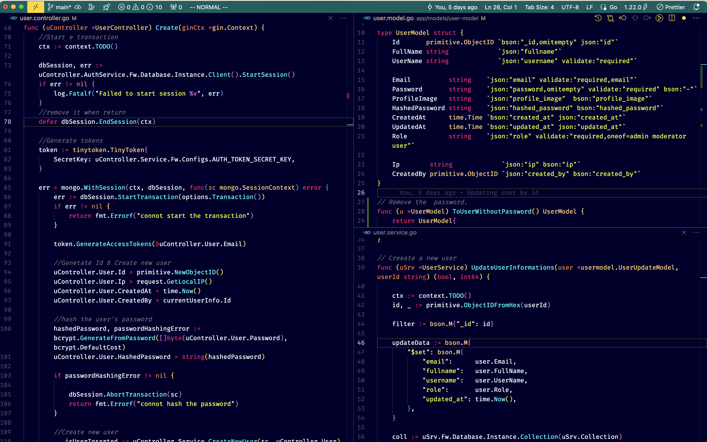

Hello,

For the past 4-5 years, my primary IDE for coding has been NeoVim. However, as my projects have grown in complexity and size, I've found that NeoVim no longer meets my needs.

I decided to switch to VS Code and customized it extensively, transforming it into a modern, performant, and Vim-like IDE.

To fully benefit from my setup, I recommend installing the following packages:

1. Vim
2. APC Customize UI++
3. FindItFaster
4. Git Projects

Here is some shortcuts that I use the most.

Explorer:

- Open Left side Explorer With the active file: **cmd+shift+e**
- Close the Explorer: **cmd+b**

Find It faster:

- Search a file: **cmd+shif+j**
- Search a text: **cmd+shif+k**

Editor:
To split an editor (Vertically or Horizontally):

- Vertical split: **space+v**
- Horizontal: **space+s**

Switch between splitted editors:

- Switching to the Right: **space+l**
- Switching to the Left: **space+h**
- Switching to the Down: **space+j**
- Switching to the Up: **space+k**
