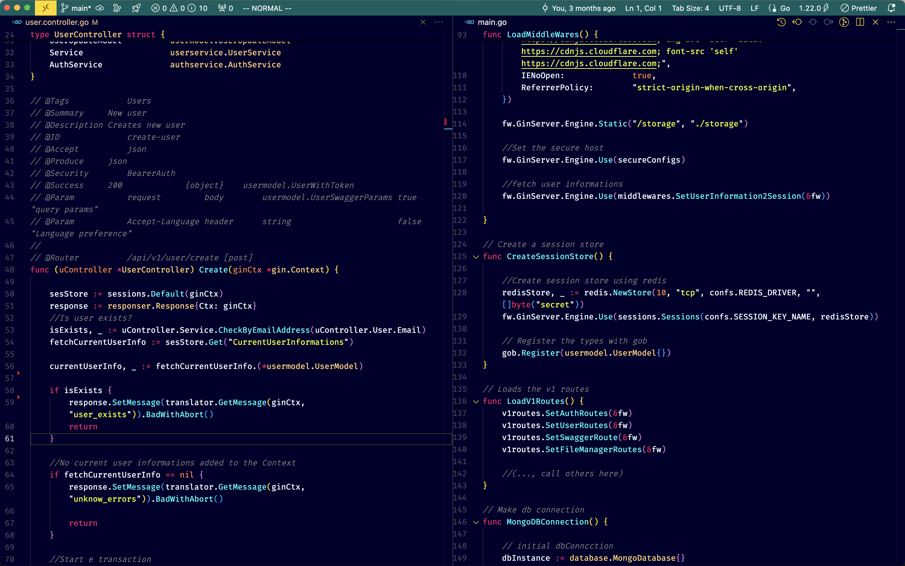

Hello,

For the past 4-5 years, my primary IDE for coding has been NeoVim. However, as my projects have grown in complexity and size, I've found that NeoVim no longer meets my needs.

I decided to switch to VS Code and customized it extensively, transforming it into a modern, performant, and Vim-like IDE.

To fully benefit from my setup, I recommend installing the following packages:

Vim
APC Customize UI++
FindItFaster
Git Projects
